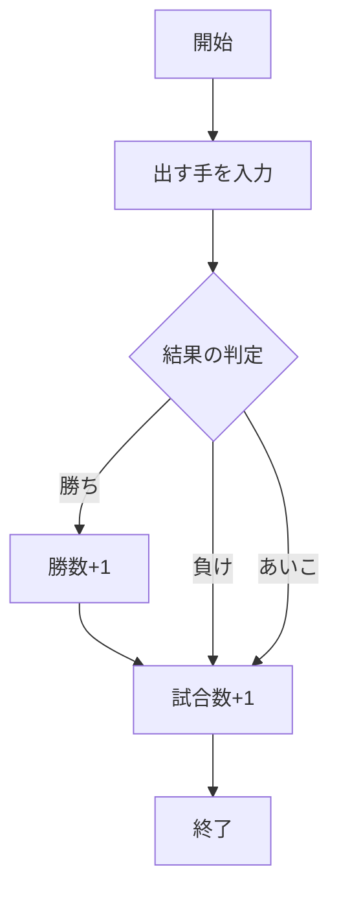
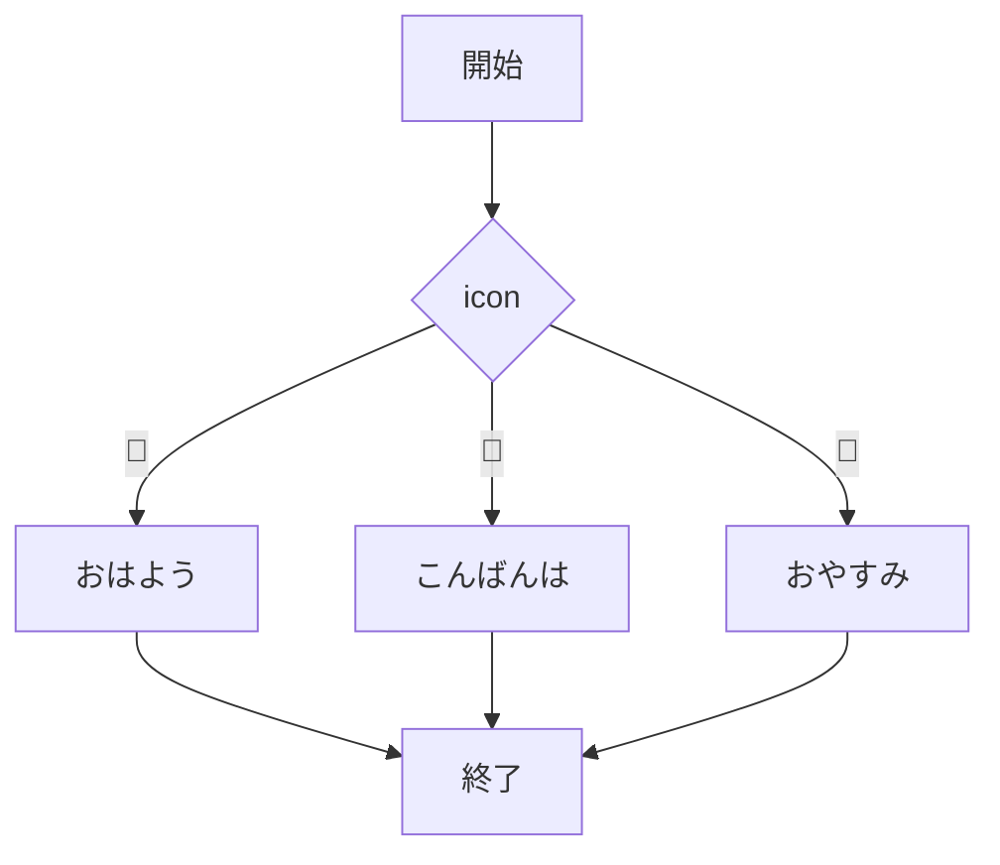
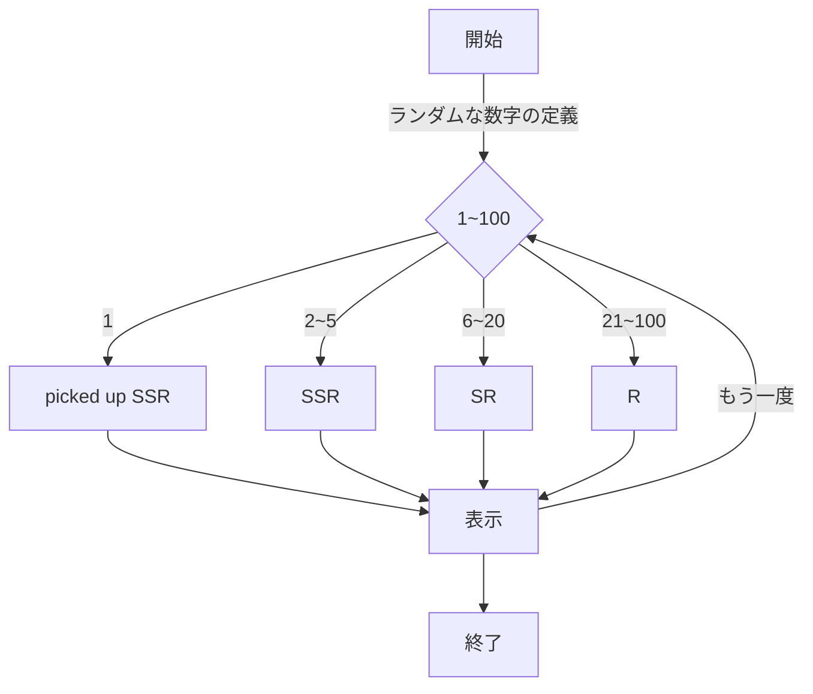
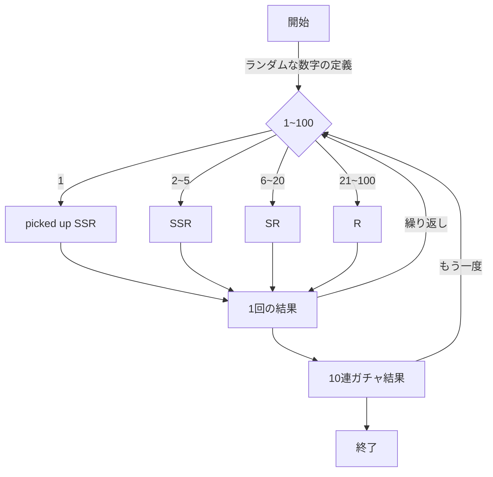
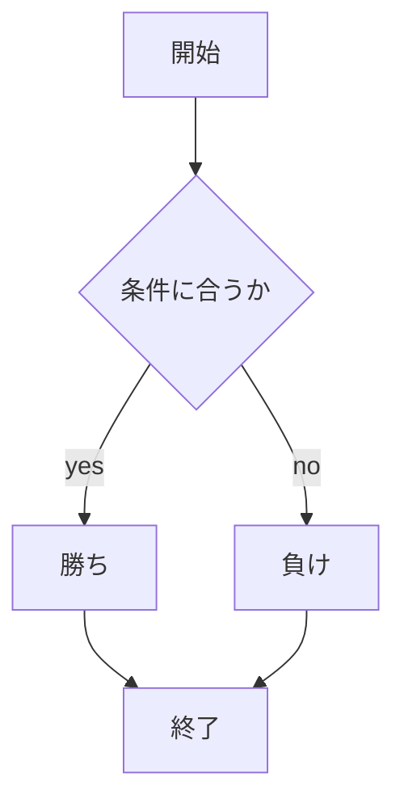

# webpro_06
## app5.js
初めにapp5.jsにNode.jsとExpressを用いてサーバーの基本的な設定を行い，以下のプログラムを実装した．
- ```じゃんけん(janken)``` 
ユーザーが出す手を選択すると，出した手を基にコンピューターと対戦した結果を検証し，勝敗，勝数，試合数をそれぞれ記録，表示する
- ```アイコン選択(response)```
ユーザーがアイコンを選択するとアイコンに合わせたテキストをそれぞれ表示する
- ```ガチャ(rare)```
ユーザーがボタンを押す（ガチャを引く）とS，SR，SSRのいずれかがランダムに決定され，結果を獲得したカードとして表示する
このとき，SSRの中で一定の確率でピックアップカードが決定される
- ```ガチャ２(rare2)```
ユーザーがボタンを押す（10連ガチャを引く）とS，SR，SSRのいずれかがランダムに決定される．これを10回繰り返し，10回分の結果を獲得したカードとして表示する

### ファイル一覧
ファイル名|説明
-|-
app5.js|プログラム本体
public/janken.html|じゃんけんの開始画面
public/rare.html|ガチャの開始画面
public/response.html|アイコン選択画面
view/janken|じゃんけんシステムのテンプレート，結果表示
view/rare|ガチャシステムのテンプレート，結果表示
view/response|アイコン選択システムのテンプレート，結果表示
README.md|これ

###　起動方法と仕様
####　共通
1. ターミナルを起動し該当のリポジトリに移動
1. ```node app5.js```でプログラムを起動
1. localhost:8080/public/(任意の機能名)にアクセス

#### helle1, hello2, icon
1. ホームぺージにアクセスするwebページにアクセスする
1. ”Hello”, ”Bonjour”, appleのアイコン画像がそれぞれ表示される

#### janken
1. 窓にグー, チョキ, パーのいずれかを入力して送信ボタンを押す
1. 勝敗と戦歴が表示される(この場合はすべて勝ちになる)
1. 結果を受けて，再度じゃんけんを行う事ができる

###### (仕様)
ここではユーザーが出す手を決定し，コンピューターとの対戦結果を基に勝敗，勝数，試合数を記録する．結果はテンプレートを用いて表示される．

初めに```app.get("/janken", (req, res)``` でurlで```/janken```に対するリクエストを処理する．```req.query```を使用してユーザーの手，勝数，試合数を受け取り，console.log関数で変数を定義する．

また，Math.floor(Math.random() * 3 + 1)で1〜3までのランダムな整数を生成し，数字に応じて，コンピュータの選択を決定する．判定後試合数を1増加させる．

　最後に```res.render('janken', display)```で```janken.ejs```テンプレートにデータ（出し手，結果，勝数，試合数）を渡し，表示する．



#### response
1. アイコンを選択すると任意のメッセージが表示される
1. 選択するアイコンを変更すると，アイコンに合わせてメッセージが表示される

###### (仕様)
ここではユーザーがアイコンを選択し，それぞれのアイコンに対応したメッセージを表示する．結果はテンプレートを用いて表示する．

初めに```app.get("/response", (req, res)``` でurl```/response```に対するリクエストを処理する．```req.query```を使用して```icon```のパラメータを取得する．

また，```icon```の値に応じて、変数```message```に異なる文字列を代入する．

　最後に```res.render('response', { message: message });```で```response.ejs```テンプレートにデータ（メッセージ）を渡し，表示する．



#### rare
1. rareのページにアクセスするとS,SR,SSRのいずれのレアリティかとレアリティを決定するランダム値が表示される
1. 1/100の確率でピックアップカードが発現，```*picked up SSR*```と表示される
1. 「もう一度」のボタンを押すことで再抽選を行う

###### (仕様)
ここではユーザーが"ガチャ"ボタンを押し，ランダムで生成された数字を基に決定された結果（S，SR，SSR，pickup）をテンプレートを用いて表示する．

　初めに```app.get("/rare", (req, res)```でurl```/rare```に対するリクエストを処理する．

また，```Math.floor(Math.random() * 100 + 1);```で1〜3までのランダムな整数を生成し，数字に応じて，コンピュータの選択をS，SR，SSR，picked up SSRのいずれかに決定する．この結果は変数```ga```に格納される

　最後に```res.render('rare', { results: results });`` にガチャの結果をデータとして渡し表示する．




#### rare2

これは```rare```の拡張板で，1回ずつではなく10連分ガチャになるようにif文と```results.push({ number: num, rare: rare }```を使用して```rare```を一部編集した

1. rareのページにアクセスする
1. "ガチャ"ボタンを押すとS,SR,SSRのいずれのレアリティかとレアリティを決定するランダム値が10枚表示される
1. 1/100の確率でピックアップカードが発現，```*picked up SSR*```と表示される
1. 「もう一度」のボタンを押すことで再抽選を行う



##　GITの管理方法

Github...プログラムやデータの変更を履歴として記録するバージョン管理システム

#####　Githubの設定
```HOME``` 
→ ```setting```
→ ```Developer``` 
→ ```settings```
→ ```Personal access tokens```
→ ```Tokens (classic)```　
→ ```Generate new token (classic)```
→ ```トークン名を決定```　
→ ```Generate token```


##### Fork(複製)の作り方
1. ターミナル上で任意のリポジトリ(貯蔵庫)に移動
1. ```$ git clone```を実行
1. リポジトリのURLを入力
1. 各自で編集


##### 編集したファイルのアップロード方法
以下を順番に実行する
1. ターミナル上で任意のリポジトリに移動
1. ```$ git add .```  (スペース+コンマ)
1. ```$ git commit -am 'コメント'```
1. ```$ git push```
1. Githubのアクセストークンを入力


#### url
```localhost:8080/public/response```

```localhost:8080/public/rare```


# メモ
## ファイル一覧
ファイル名|説明
-|-
app5.js|プログラム本体
public/janken.html|じゃんけんの開始画面
public/response.html|アイコン画面
values/janken.ejs　|じゃんけんのテンプレート

ファイル
```javascript
    console.log('Hello');
```


1. ```node app5.js```でプログラムを起動する
1. webブラウザでlocalhost:8080/public/janken.htmlにアクセスする
1. 自分の手を入力する



