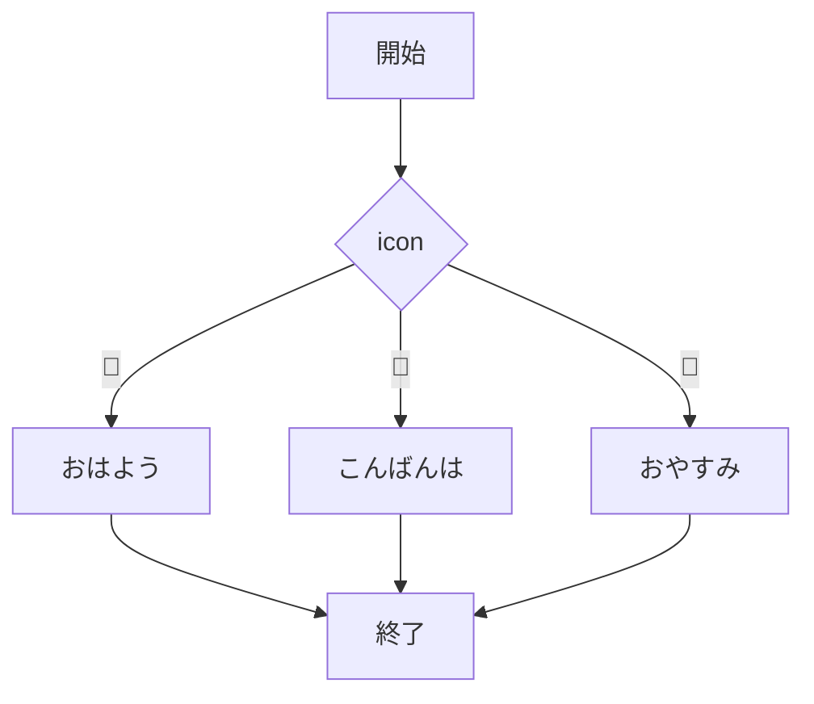
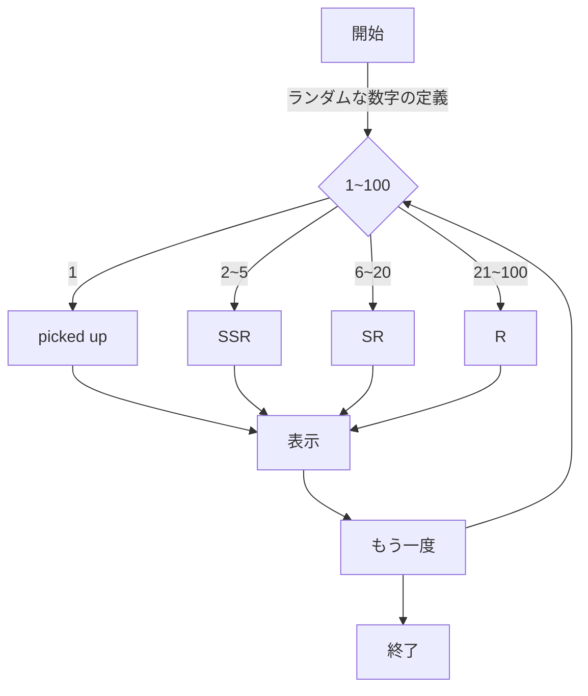
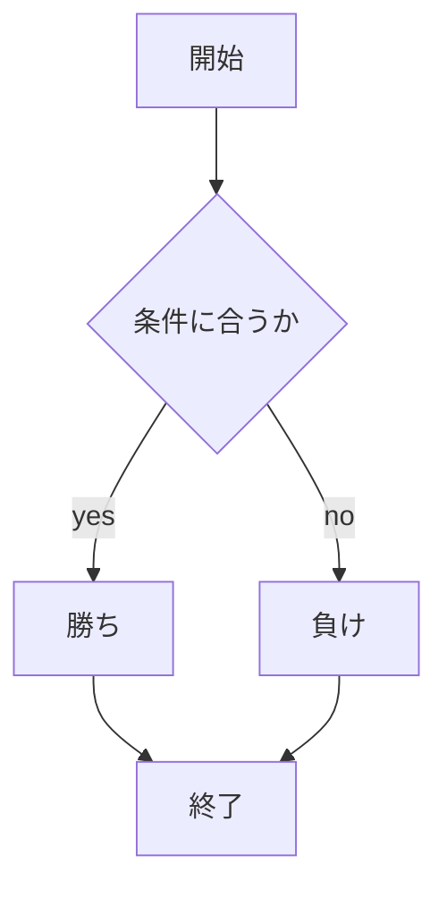

# webpro_06
## app5.js

####　起動方法・使用手順
#####　共通
1. ターミナルを起動し該当のリポジトリに移動
1. ```node app5.js```でプログラムを起動
1. localhost:8080/public/(任意の機能名)にアクセス

##### helle1, hello2, icon
webページにそれぞれ”Hello”, ”Bonjour”, appleのアイコン画像が表示される

##### janken
1. 窓に”グー”, ”チョキ”, ”パー”のいずれかを入力して送信ボタンを押す
1. 勝敗と戦歴が表示される(この場合はすべて勝ちになる)

##### response
アイコンを選択すると任意のメッセージが表示される

##### rare
1. rareのページにアクセスするとS,SR,SSRのいずれのレアリティかとレアリティを決定するランダム値が表示される
1. 1/100の確率でピックアップカードが発現，```*picked up SSR*```と表示される
1. 「もう一度」のボタンを押すことで再抽選を行う

####　機能
##### response

##### rare


##　GITの管理方法

Github...プログラムやデータの変更を履歴として記録するバージョン管理システム

#####　Githubの設定
```HOME``` 
→```setting```
→```Developer``` 
→```settings```
→```Personal access tokens```
→　```Tokens (classic)```　
→```Generate new token (classic)```
→　```トークン名を決定```　
→```Generate token```


##### Fork(複製)の作り方
1. ターミナル上で任意のリポジトリ(貯蔵庫)に移動
1. ```$ git clone```を実行
1. リポジトリのURLを入力
1. 各自で編集


##### 編集したファイルのアップロード方法
以下を順番に実行する
1. ターミナル上で任意のリポジトリに移動
1. ```$ git add .```  (スペース+コンマ)
1. ```$ git commit -am 'コメント'```
1. ```$ git push```
1. Githubのアクセストークンを入力


#### url
```localhost:8080/public/response```

```localhost:8080/public/rare```


# メモ
## ファイル一覧
ファイル名|説明
-|-
app5.js|プログラム本体
public/janken.html|じゃんけんの開始画面
public/response.html|アイコン画面
values/janken.ejs　|じゃんけんのテンプレート

ファイル
```javascript
    console.log('Hello');
```


1. ```node app5.js```でプログラムを起動する
1. webブラウザでlocalhost:8080/public/janken.htmlにアクセスする
1. 自分の手を入力する



